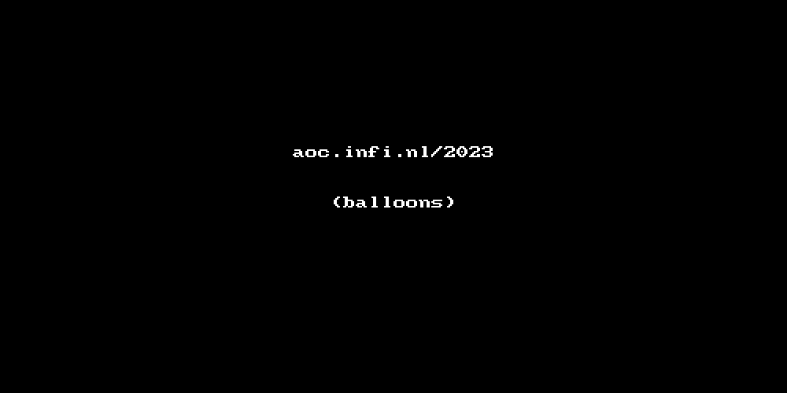

# Infi 2023 Tribute Puzzle

Code to solve [the Infi Tribute puzzle](https://aoc.infi.nl/2023).
Puzzle solution also spits out data (in form of code) to be pasted onto [this codepen](https://codepen.io/jeroenheijmans/pen/ExrdJJL?editors=0010) to see your packages float inside their balloons.
Sort of.

## Floating packages

## Floating balloons

